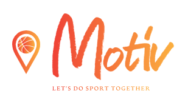
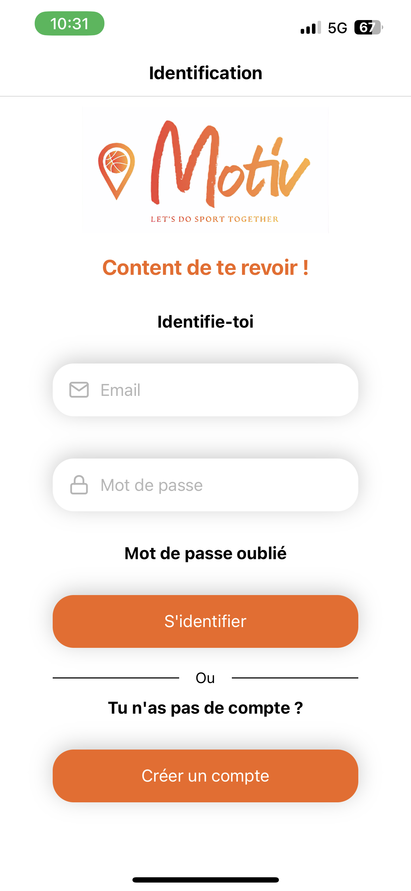
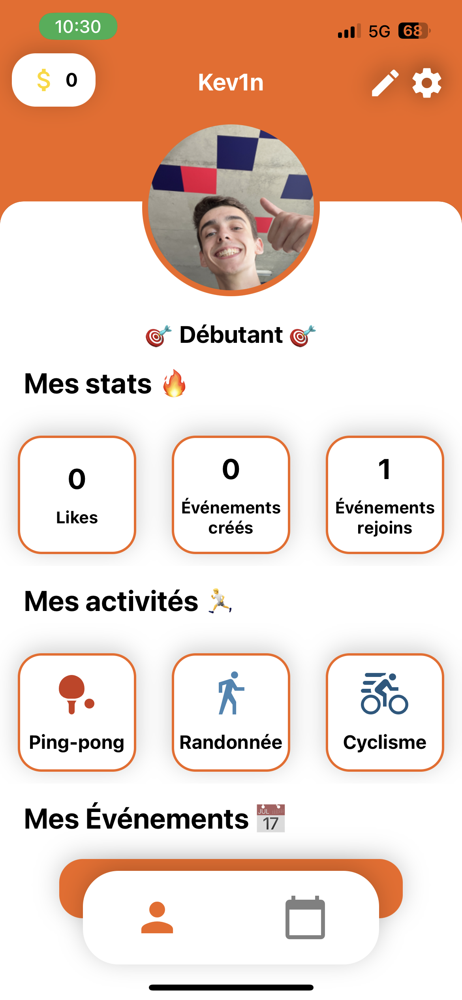
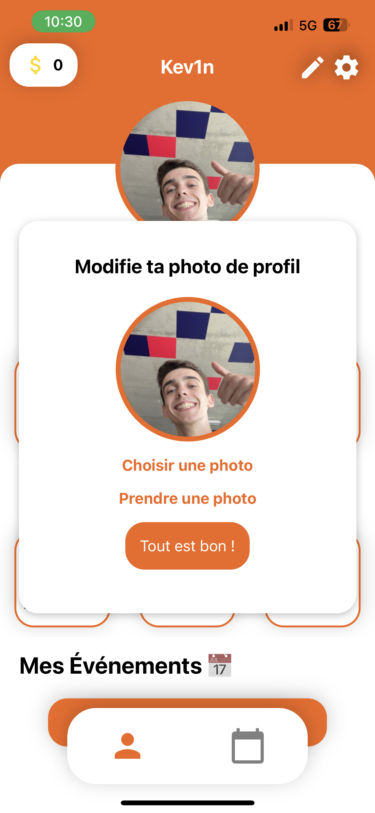
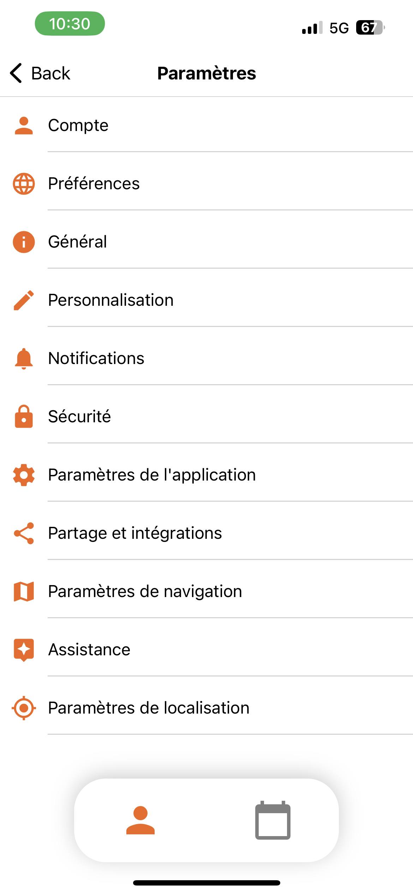
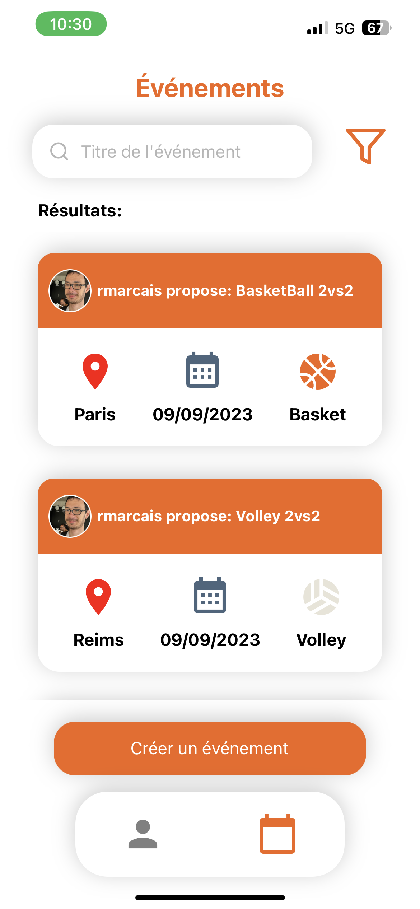

<p align="center">
  
</p>


# Portfolio project: Motiv'

<p align="center">
  
</p>

## Introduction

Hi everybody ! We are Rémi Marçais and Maxence Potier. We are software development students at Holberton School Students in Full Stack Specialization and this is our final project of the year ! For our portfolio project, we created an application where you can meet people to do sport togethers and where you can join sport events. To be short, it is like a dating app, but for sport !

Rémi got this idea in April 2022 when he wanted to go the gym. Indeed, he had nobody to go with, which discouraged him most of the time. After a few sessions, he said to himself: *"It would be so cool if I could go there with people that can then become my friend !*. He thought the idea was good and would be even better if he extended the concept to every sports (Basketball, Football, Dance, Tennis...) because he thinks this kind of activity is better together. So he started to develop his idea in his Portfolio project of the Foundations year but a website.

For Maxence, it was almost the same. He started to go to the gym alone and was discouraged too so he did a website for find someone to go to the gym for his Portfolio project of the Foundations year.

During the year of Specialisations, we found that we had the same idea so we decided to combine our two ideas and make our project a reality. To do this, we decided not to work on a website but on an app, given that everything now happens on our smartphones. So we started from scratch and moved on to a MERN project. 

Our objective is to deploy the app, have thousands or even millions users and also be the most popular sports dating app.

## Time

We just had 2 weeks on the reserch and 4 weeks to develop the application.

Technical challenges:

- Learn how to work well in team
- Create an authentification system with automatic mails
- Learn how to use React Native

Non-technical challenges:

- Time (Maxence is also a SWE in Bordeaux, France/ School's projects at the same time)
- Heat wave
- Budget

## Simple application launch / usage

### Clone the repo

```
$ git clone https://github.com/Edin93/motiv.git
```

### Start the back
```
$ cd backend
$ npm install
$ npm run dev
```

### Start the front

```
$ cd frontend
$ npm install
$ npm run start
```

### Detailed technical informations
* For a detailed technical documentation / informations you should check this [Markdown pages summary](./readme_pages_summary.md).

## See the result

### You can login with an account
<p align="center">
  
</p>

### Access your profile
<p align="center">
  
</p>

### Change your profile picture
<p align="center">
  
</p>

### Go to the settings and logout
<p align="center">
  
</p>

### See the available events, their info and join them
<p align="center">
  
</p>

## Contribution

[Houssem Eddine Ben Khalifa](https://www.linkedin.com/in/ben-khalifa-houssem-eddine/)

[Rémi Marçais](https://www.linkedin.com/in/remi-marcais/)

[Maxence Potier](https://www.linkedin.com/in/maxence-potier/)

## License

This project is not opensource. Please don't use this code for any purpose, in threat of lawsuit.

<p align="center">
  
</p>
